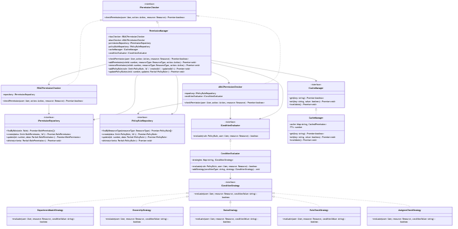

# TypeScript 권한 관리 시스템

이 프로젝트는 TypeScript를 사용하여 교육 기관의 사용자 권한 관리 시스템을 구현합니다. RBAC(Role-Based Access Control)와 ABAC(Attribute-Based Access Control)를 결합하여 유연하고 강력한 권한 관리 기능을 제공합니다.

## 주요 기능

- **역할 기반 접근 제어 (RBAC)**
  - 교육 상담사, 학습 관리자 등 역할별 권한 관리
  - 팀장과 일반 직원의 권한 구분
  - 리소스별 세부 권한 설정

- **속성 기반 접근 제어 (ABAC)**
  - 부서별 접근 제어
  - 소유권 기반 권한 검사
  - 상태 기반 권한 제어
  - 할당자 기반 권한 검사

- **성능 최적화**
  - 권한 검사 결과 캐싱
  - 우선순위 기반 정책 평가
  - 병렬 권한 검사 처리

## 설치 방법

```bash
# 의존성 설치
npm install

# TypeScript 컴파일
npm run build
```

## 사용 방법

### 권한 관리 기능

```typescript
import { PermissionManager } from './dist/db_permission.js';

// 권한 관리자 초기화
const permissionManager = new PermissionManager(
  new DatabasePermissionRepository(),
  new DatabasePolicyRuleRepository()
);

// 권한 체크
const hasPermission = await permissionManager.checkPermission(
  user,
  'inquiry:read',
  inquiry
);

// 권한 추가
await permissionManager.addPermission(
  roleId,
  'inquiry',
  'inquiry:read'
);

// 정책 규칙 추가
await permissionManager.addPolicyRule({
  resourceType: 'inquiry',
  action: 'inquiry:read',
  conditionType: 'department_match',
  conditionValue: 'sales',
  priority: 1
});
```

## 시스템 구조



## 주요 컴포넌트 설명

### 1. 권한 체크 시스템
- `PermissionManager`: 전체 권한 관리 시스템의 진입점
- `RBACPermissionChecker`: 역할 기반 접근 제어
- `ABACPermissionChecker`: 속성 기반 접근 제어

### 2. 조건 평가 시스템
- `ConditionEvaluator`: 조건 평가를 관리하는 중앙 클래스
- `IConditionStrategy`: 조건 평가 전략 인터페이스
- 구체적인 전략 클래스들:
  - `DepartmentMatchStrategy`
  - `OwnershipStrategy`
  - `StatusStrategy`
  - `RoleCheckStrategy`
  - `AssigneeCheckStrategy`

### 3. 저장소 시스템
- `IPermissionRepository`: 역할 기반 권한 저장소
- `IPolicyRuleRepository`: 정책 규칙 저장소

### 4. 캐시 시스템
- `CacheManager`: 권한 체크 결과를 캐싱하여 성능 최적화

## 역할 정의

### 1. 관리자 (Admin)
- 모든 리소스에 대한 완전한 접근 권한
- 시스템 설정 및 관리 권한

### 2. 교육 상담사 (Education Counselor)
- 문의사항 조회 및 업데이트
- 학생 정보 조회
- 상담 일정 관리

### 3. 교육 상담 팀장 (Education Counselor Leader)
- 교육 상담사 권한 + 추가 권한
- 문의사항 할당 및 관리
- 팀원 관리

### 4. 학습 관리자 (Learning Manager)
- 문의사항 생성 및 관리
- 상담 일정 관리
- 학습 진도 관리

### 5. 학습 관리 팀장 (Learning Manager Leader)
- 학습 관리자 권한 + 추가 권한
- 팀원 관리
- 성과 평가

## 개발 모드 실행

```bash
# TypeScript 파일 변경 감시 모드 실행
npm run dev
```

## 참고사항

- 프로젝트는 ES 모듈을 사용합니다.
- TypeScript 4.x 이상 버전이 필요합니다.
- Node.js 14.x 이상 버전이 필요합니다. 